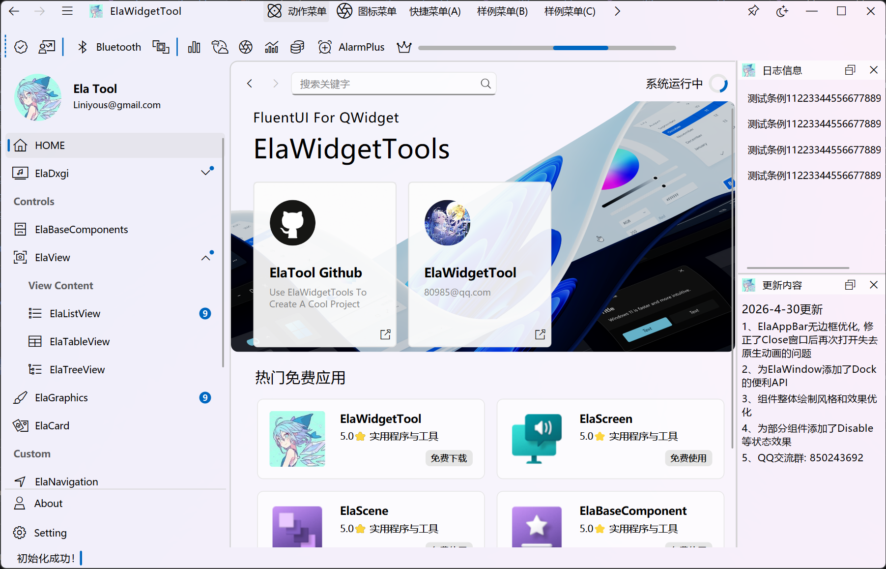
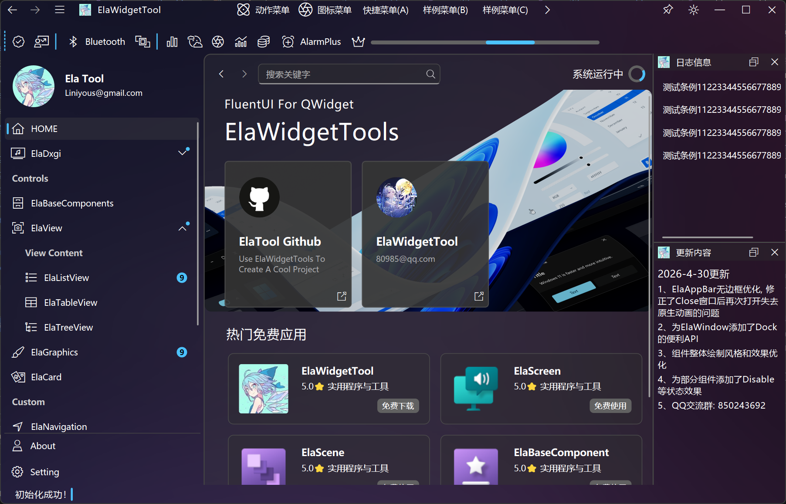

# ElaWidgetTools

## 简介

本项目基于 [Liniyous/ElaWidgetTools](https://github.com/Liniyous/ElaWidgetTools) 独立修改发展而来。

基于 Qt Widget 开发的 FluentUI 风格组件库，提供不限于组件的常用集成功能。目前共有 **100+** 个公开组件，涵盖基础控件、数据展示、导航布局、弹出交互、编辑输入等类别。完整 API 文档见 [doc/API.md](doc/API.md)。

## 支持平台

| Windows | Ubuntu/Kylin | macOS |
|---------|-------------|-------|
| ![win-badge] | ![ubuntu-badge] | ![macos-badge] |

[win-badge]: https://img.shields.io/badge/Windows-Passing-61C263

[ubuntu-badge]: https://img.shields.io/badge/Ubuntu-Passing-61C263

[macos-badge]: https://img.shields.io/badge/macOS-Passing-61C263

## Qt 版本兼容性

> **⚠️ 不建议在 Windows 上使用 Qt 6.11.0。** 该版本在 Windows 平台存在 Popup 窗口透明区域合成行为变更的 bug，导致使用 `drawEffectShadow` 绘制阴影的组件出现透明边框（macOS 不受影响）。此问题已在下一版本中修复。本项目通过 `Q_OS_WIN && QT_VERSION_CHECK(6, 11, 0)` 条件编译针对该版本进行了适配，但仍建议升级或使用其他版本以获得最佳体验。

## 主界面预览

<div align=center>
  
</div>
<div align=center>
  
</div>

## 支持的组件

### 基础设施

| 组件                     | 说明           | 备注                         |
|------------------------|--------------|----------------------------|
| ElaApplication         | 程序初始化        | 主题/显示模式初始化，Mica/Acrylic效果    |
| ElaTheme               | 主题管理器        | Light/Dark 主题切换   |
| ElaWindow              | 带导航栏的无边框窗口   | 侧边导航栏+堆栈页面+面包屑+路由           |
| ElaWidget              | 无边框模态窗口      | 独立的无边框弹出窗口                   |
| ElaAppBar              | 窗口顶部标题栏      | 支持拖动窗口，最小化、最大化、关闭窗口、调整窗口尺寸 |
| ElaNavigationRouter    | 路由跳转         | 前进/后退导航历史管理                  |
| ElaRouter              | 声明式路由器       | 路由表/守卫/动态路由/懒加载/嵌套路由，类 Vue Router |
| ElaEventBus            | 事件总线         | 跨组件解耦通信                      |
| ElaIcon                | 图标           | 3500+ FluentUI 图标           |
| ElaLog                 | 消息日志         | 分级日志输出与管理                    |

### 按钮与输入

| 组件                     | 说明           | 备注                         |
|------------------------|--------------|----------------------------|
| ElaPushButton          | 按钮           | 支持图标、自定义颜色                   |
| ElaIconButton          | 图标按钮         | 纯图标按钮，支持悬停效果                 |
| ElaToolButton          | 带下拉菜单的工具按钮   | 支持弹出菜单和图标文字组合                |
| ElaSplitButton         | 分裂按钮         | 左侧主操作+右侧下拉菜单，独立Hover/Press  |
| ElaToggleSwitch        | 开关按钮         | 滑动动画，支持拖拽切换                  |
| ElaToggleButton        | 切换按钮         | 点击切换选中/未选中状态                 |
| ElaCheckBox            | 勾选框          | 支持三态（选中/未选中/半选）              |
| ElaRadioButton         | 单选按钮         | 互斥选择，支持按钮组                   |
| ElaComboBox            | 下拉框          | 自定义弹出容器样式                    |
| ElaMultiSelectComboBox | 多选下拉框        | 支持多项选择，标签展示                  |
| ElaLineEdit            | 输入框          | 焦点动画，自定义样式                   |
| ElaPasswordBox         | 密码输入框        | 带眼睛图标切换显示/隐藏密码              |
| ElaPlainTextEdit       | 文本编辑框        | 多行文本输入                       |
| ElaSpinBox             | 微调框          | 整数输入，上下箭头调节                  |
| ElaDoubleSpinBox       | 微调框          | 浮点数输入                        |
| ElaNumberBox           | 增强数字输入框      | 加减按钮、鼠标滚轮、键盘方向键、双击编辑、范围限制   |
| ElaSlider              | 拖动条          | 水平/垂直，自定义样式                  |
| ElaKeyBinder           | 单按键绑定器       | 支持macOS Fn键，快捷键录制            |
| ElaCaptcha             | 验证码输入框       | 分格输入，自动跳格，支持粘贴分发和键盘导航，数字/字母模式 |
| ElaRatingControl       | 星级评分         | 支持Hover预览、只读模式，可配置星星数量       |
| ElaSuggestBox          | 建议搜索框        | 输入联想，自动补全建议列表                |
| ElaDropDownButton      | 下拉按钮         | 整个按钮触发下拉菜单，支持图标+文字           |
| ElaSelectorBar         | 分段选择器        | 滑动指示条动画，支持图标，筛选/模式切换         |
| ElaTransfer            | 穿梭框          | 双列表互选，支持搜索过滤、全选、主题跟随          |
| ElaEmojiPicker         | 表情选择器        | Telegram风格，分类标签页+搜索+最近使用+网格选择    |
| ElaAutoComplete        | 自动补全输入框      | 实时过滤建议列表，支持包含/前缀/后缀/正则表达式匹配，高亮匹配文字  |
| ElaTreeSelect          | 树形选择下拉框      | 弹出树形视图选择叶节点，支持搜索过滤、路径显示、展开/收起自适应高度  |
| ElaUploadArea          | 文件上传区域       | 拖拽/点击上传，文件类型/大小/数量验证，文件列表管理，自定义对话框标题  |
| ElaCopyButton          | 一键复制按钮       | 点击复制到剪贴板，图标切换反馈动画，支持纯图标/图标+文字模式  |

### 数据展示

| 组件                     | 说明           | 备注                         |
|------------------------|--------------|----------------------------|
| ElaText                | Text文本       | 支持多种预设样式（Caption/Body/Title/Display） |
| ElaInfoBadge           | 信息徽章         | 支持Dot/数值/图标三种模式，5种严重等级颜色     |
| ElaTag                 | 标签/胶囊        | 支持5种颜色、可关闭、可选中模式            |
| ElaPersonPicture       | 头像控件         | 支持图片/首字母/默认图标，圆形裁剪          |
| ElaStatCard            | 统计卡片         | 大数字+趋势箭头+描述，支持图标和三种趋势类型       |
| ElaProgressBar         | 进度条          | 支持进度模式和忙碌动画模式               |
| ElaProgressRing        | 进度环          | 环形进度，支持百分比显示和忙碌动画           |
| ElaSteps               | 步骤进度指示器      | 完成/当前/待定状态，支持上一步/下一步         |
| ElaTimeline            | 时间线          | 时间戳+标题+内容+可选图标，垂直布局         |
| ElaSkeleton            | 骨架屏加载占位      | Text/Circle/Rectangle三种形态，Shimmer动画 |
| ElaDivider             | 分隔线          | 支持水平/垂直，可带文字（左/中/右对齐）       |
| ElaLCDNumber           | LCD数字显示      | 仿液晶屏数字显示                     |
| ElaCountdown           | 倒计时组件        | 天/时/分/秒翻牌显示，支持目标时间和剩余秒数两种模式  |
| ElaQRCode              | 二维码生成器       | 输入文本/URL 生成二维码，支持自定义颜色和导出 Pixmap |

### 卡片

| 组件                     | 说明           | 备注                         |
|------------------------|--------------|----------------------------|
| ElaAcrylicUrlCard      | 带图片的交互式亚克力卡片 | 支持URL跳转                    |
| ElaImageCard           | 图片卡片         | 圆角图片展示                       |
| ElaInteractiveCard     | 带图片的交互式透明卡片  | 鼠标悬停透明度变化                    |
| ElaPopularCard         | 热门卡片         | 适用于推荐/热门内容展示                 |
| ElaPromotionCard       | 促销卡片         | 大图+标题的推广卡片                   |
| ElaReminderCard        | 带图片的提醒卡片     | 图片+文字的提醒通知样式                 |

### 导航与布局

| 组件                     | 说明           | 备注                         |
|------------------------|--------------|----------------------------|
| ElaNavigationBar       | 导航栏          | 支持展开/折叠/紧凑模式               |
| ElaBreadcrumbBar       | 面包屑组件        | 自动处理点击事件                   |
| ElaPivot               | 轴转导航         | Tab式页面切换导航                   |
| ElaPagination          | 分页导航         | 自动省略号，支持跳转，可配置可见页码数          |
| ElaTabBar              | 选项卡          | 谷歌浏览器风格，支持拖拽排序              |
| ElaTabWidget           | 选项卡页面        | 谷歌浏览器风格，内嵌页面容器              |
| ElaScrollPage          | 滚动页面         | 自带堆栈页面和面包屑导航               |
| ElaScrollPageArea      | 滚动页面区域组件     | 带圆角背景的区域容器                   |
| ElaScrollArea          | 滚动区域         | 可设置鼠标拖动                    |
| ElaScrollBar           | 滚动条          | 自动隐藏，悬停展开                    |
| ElaFlowLayout          | 流式布局         | 支持动画，自动换行排列                  |
| ElaExpander            | 折叠展开面板       | 支持向上/向下展开，带平滑高度动画            |
| ElaGroupBox            | 分组框          | 带标题的控件分组容器                   |
| ElaSplitter            | 分割面板         | 可拖拽分割，FluentUI 风格手柄，支持水平/垂直  |

### 弹出与交互

| 组件                     | 说明           | 备注                         |
|------------------------|--------------|----------------------------|
| ElaMenu                | 菜单           | 支持图标、快捷键、子菜单                 |
| ElaMenuBar             | 菜单栏          | 窗口顶部菜单栏                      |
| ElaToolBar             | 工具栏          | 可停靠工具栏，支持溢出                  |
| ElaCommandBar          | 命令栏          | 带溢出菜单，图标+文字按钮，独立Hover/Press  |
| ElaStatusBar           | 状态栏          | 窗口底部状态信息栏                    |
| ElaContentDialog       | 带遮罩的对话框      | 全窗口遮罩+居中对话框                  |
| ElaDialog              | 对话框          | 标准无边框对话框                     |
| ElaInputDialog         | 输入对话框        | 带输入框的确认对话框                   |
| ElaMessageDialog       | 消息对话框        | 确认/取消消息对话框                   |
| ElaMessageBar          | 弹出式信息栏       | 支持八方向，锚定位置                 |
| ElaMessageButton       | 弹出信息按钮       | 点击弹出带颜色的消息提示                 |
| ElaToast               | 轻量提示         | 自动消失，支持Success/Info/Warning/Error四种类型 |
| ElaSnackbar            | 底部通知条        | 带操作按钮（如撤销），自动堆叠/重排，可配置最大数量    |
| ElaFloatButton         | 悬浮操作按钮       | 圆形按钮，支持四角定位、菜单展开、hover 动画、自动跟随父窗口 |
| ElaEmojiPicker         | 表情选择器        | Telegram风格，分类标签页+搜索+最近使用+网格选择    |
| ElaFlyout              | 轻量弹出面板       | 锚定目标控件，Light Dismiss，可嵌入自定义Widget |
| ElaTeachingTip         | 引导提示气泡       | 带箭头指向目标控件，支持4方向+自动定位         |
| ElaToolTip             | 工具提示         | 悬停显示，支持自定义内容和延迟              |
| ElaColorDialog         | 颜色选择器        | HSV/RGB 颜色选取                 |
| ElaCalendar            | 日历视图         | 月/年视图切换，日期选择                 |
| ElaCalendarPicker      | 日期选择器        | 点击弹出日历选择日期                   |
| ElaSpotlight           | 聚光灯引导        | 全窗口遮罩挖洞高亮，支持多步骤引导和平滑过渡动画     |
| ElaPopconfirm          | 气泡确认框        | 锚定目标控件弹出，带图标/标题/确认取消按钮，Light Dismiss |
| ElaRoller              | 滚轮选择器        | 纵向滚轮列表选择                     |
| ElaRollerPicker        | 滚轮选择器        | 多列滚轮组合（如时间/日期）               |
| ElaDrawerArea          | 抽屉区域         | 可展开/收起的侧边抽屉面板               |
| ElaInfoBar             | 信息栏          | 内嵌式持久提示，支持Info/Success/Warning/Error四种级别，可添加操作按钮，关闭动画 |

### 窗口与面板

| 组件                     | 说明           | 备注                         |
|------------------------|--------------|----------------------------|
| ElaWizard              | 向导窗口         | 多步骤对话框，内置步骤指示器，上一步/下一步/完成    |
| ElaNotificationCenter  | 通知中心         | 右侧滑出面板，堆叠通知卡片，支持清除和滚动        |
| ElaDockWidget          | 停靠窗口         | 可拖拽停靠的浮动面板                   |
| ElaSplashScreen        | 启动屏          | 品牌展示+加载进度，支持进度条/进度环/Logo/拖拽   |
| ElaSheetPanel          | 底部滑出面板       | 半模态Sheet，支持三级停靠(Peek/Half/Full)和拖拽  |
| ElaWatermark           | 全局水印覆盖       | 文字/图片水印，支持旋转角度、透明度、间距、HiDPI，鼠标事件穿透 |

### 视图

| 组件                     | 说明           | 备注                         |
|------------------------|--------------|----------------------------|
| ElaListView            | 列表视图         | 自定义委托绘制，FluentUI样式           |
| ElaTableView           | 表格视图         | 自定义表头和行样式                    |
| ElaTableWidget         | 表格部件         | 高级表格，悬停行高亮                   |
| ElaTreeView            | 树型视图         | 可展开/折叠的层级视图                  |
| ElaGraphicsScene       | 高级场景         | 大量实用API，节点管理                 |
| ElaGraphicsView        | 高级视图         | 按键缩放、拖动，画布操作                 |
| ElaGraphicsItem        | 高级图元         | 大量实用API，自定义绘制                |
| ElaPromotionView       | 促销卡片视窗       | 多卡片轮播展示容器                    |
| ElaVirtualList         | 虚拟滚动列表       | 万级数据量流畅滚动，批量布局+统一行高优化         |

### 编辑器与渲染

| 组件                     | 说明           | 备注                         |
|------------------------|--------------|----------------------------|
| ElaCodeEditor          | 代码编辑器        | 行号、8种语言语法高亮（C/C++/C#/Python/JS/Lua/Rust/PHP）、当前行高亮 |
| ElaMarkdownViewer      | Markdown渲染器  | 基于QTextBrowser，支持主题切换和外部链接      |

### 聊天与终端

| 组件                     | 说明           | 备注                         |
|------------------------|--------------|----------------------------|
| ElaChatBubble          | 聊天气泡         | 左右对齐、头像、时间戳、发送状态、图片消息、双击图片预览（缩放/旋转/触摸板手势） |
| ElaDashboardGauge      | 仪表盘          | 动画指针、刻度/数字分区变色、警告/危险百分比、小数位控制、自定义弧宽/角度 |
| ElaTerminalWidget      | 终端模拟器        | 命令输入输出、历史记录上下翻页、Tab补全信号、彩色输出、主题跟随 |

### 系统功能

| 组件                     | 说明           | 备注                         |
|------------------------|--------------|----------------------------|
| ElaDxgiManager         | DXGI采集器      | 支持自动选择采集设备 效率远高于原生采集       |
| ElaScreenCaptureManager| 屏幕采集         | macOS ScreenCaptureKit      |
| ElaExponentialBlur     | 指数模糊         | 高性能图像模糊处理                    |

## API 文档

完整的组件 API 文档由脚本自动生成，见 [doc/API.md](doc/API.md)。

重新生成：
```bash
python3 scripts/generate_docs.py
```

## PySide6 绑定

本项目提供基于 Shiboken6 的 PySide6 绑定基础设施，支持在 Python 中使用所有组件。

### 前置依赖

```bash
pip install PySide6 shiboken6 shiboken6-generator
```

### 构建绑定

```bash
# 生成 typesystem 和 global.h
python3 scripts/generate_bindings.py

# 构建 ElaWidgetTools 动态库
cmake -B build -DELAWIDGETTOOLS_BUILD_STATIC_LIB=OFF -DCMAKE_BUILD_TYPE=Release
cmake --build build --target ElaWidgetTools

# 运行 shiboken6 生成绑定代码，然后编译为 Python 模块
# 详细步骤参考 bindings/ 目录
```

完整示例见 [PySide6Example/](PySide6Example/) 目录。

## 致谢

本项目基于 [Liniyous/ElaWidgetTools](https://github.com/Liniyous/ElaWidgetTools) 修改而来，感谢原作者的开源贡献。

## 许可证

ElaWidgetTools 使用 MIT 许可证授权所有类型项目，但要求所有分发的软件中必须保留本项目的MIT授权许可；所有未保留授权分发的商业行为均将被视为侵权行为
